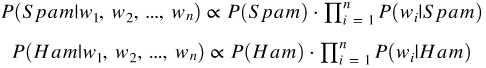
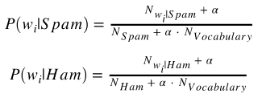
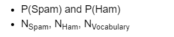
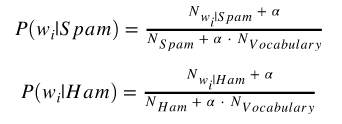

## Python Project 16: Building a Spam Filter with Naive Bayes
In this project, we're going to build a spam filter for SMS messages using the multinomial Naive Bayes algorithm. Our goal is to write a program that classifies new messages with an accuracy greater than 80% — so we expect that more than 80% of the new messages will be classified correctly as spam or ham (non-spam).

To train the algorithm, we'll use a dataset of 5,572 SMS messages that are already classified by humans. The dataset was put together by Tiago A. Almeida and José María Gómez Hidalgo, and it can be downloaded from the [The UCI Machine Learning Repository](https://archive.ics.uci.edu/ml/datasets/sms+spam+collection). The data collection process is described in more details on [this page](http://www.dt.fee.unicamp.br/~tiago/smsspamcollection/#composition), where you can also find some of the papers authored by Tiago A. Almeida and José María Gómez Hidalgo.

### Exploring the Dataset
first we read the dataset: "`SMSSpamCollection`". 
- it has 5572 rows and 2 columns. 
- 87% of the messages are ham, and the remaining 13% are spam.

### Training and Test Set
We have split our dataset into a training and a test set, where the training set accounts for 80% of the data, and the test set for the remaining 20%. Then we analyzed the percentage of spam and ham messages in the training and test sets. As expected both training and test datasets has the percentages to be close to what we have in the full dataset, where about 87% of the messages are ham, and the remaining 13% are spam

The results look good! We'll now move on to cleaning the dataset.

### Data Cleaning
To calculate all the probabilities required by the algorithm, we'll first need to perform a bit of data cleaning to bring the data in a format that will allow us to extract easily all the information we need.

Essentially, we want to bring data to this format:

#### Letter Case and Punctuation
Then we removed all the punctuation and bringing every letter to lower case. 
#### Creating the Vocabulary
Then we created the vocabulary, which in this context means a list with all the unique words in our training set.

### The Final Training Set
- We now used the vocabulary we just created to make the data transformation we want.
- Then Concatenated the DataFrame we just built above with the DataFrame containing the training set (this way, we'll also have the `Label` and the `SMS` columns). Use the `pd.concat()` function.

### Calculating Constants First
Now done with cleaning the training set, and we have created the spam filter. The Naive Bayes algorithm will need to answer these two probability questions to be able to classify new messages:
 
                                            
Also, to calculate P(wi|Spam) and P(wi|Ham) inside the formulas above, we'll need to use these equations:
  

Some of the terms in the four equations above will have the same value for every new message. We can calculate the value of these terms once and avoid doing the computations again when a new messages comes in. Below, we used our training set to calculate:

We also used Laplace smoothing and set $\alpha = 1$.

### Calculating Parameters
Now that we have the constant terms calculated above, we calculated the parameters $P(w_i|Spam)$ and $P(w_i|Ham)$. Each parameter will thus be a conditional probability value associated with each word in the vocabulary.

The parameters are calculated using the formulas:

            

### Classifying A New Message
Now that we have all our parameters calculated, we created the spam filter. The spam filter can be understood as a function that:

- Takes in as input a new message (w1, w2, ..., wn).
- Calculates P(Spam|w1, w2, ..., wn) and P(Ham|w1, w2, ..., wn).
- Compares the values of P(Spam|w1, w2, ..., wn) and P(Ham|w1, w2, ..., wn), and:
    - If P(Ham|w1, w2, ..., wn) > P(Spam|w1, w2, ..., wn), then the message is classified as ham.
    - If P(Ham|w1, w2, ..., wn) < P(Spam|w1, w2, ..., wn), then the message is classified as spam.
    - If P(Ham|w1, w2, ..., wn) = P(Spam|w1, w2, ..., wn), then the algorithm may request human help.

### Measuring the Spam Filter's Accuracy
The test results looks promising, but let's see how well the filter does on our test set, which has 1,114 messages.
so, We wrote a function that returns classification labels instead of printing them and the we used it to create a new column in our test set called `predicted`.

### Result Analysis
The accuracy is close to 98.74%, which is really good. Our spam filter looked at 1,114 messages that it hasn't seen in training, and classified 1,100 correctly.

In this project, we managed to build a spam filter for SMS messages using the multinomial Naive Bayes algorithm. The filter had an accuracy of 98.74% on the test set we used, which is a pretty good result. Our initial goal was an accuracy of over 80%, and we managed to do way better than that.

## Note
### - Please see the `spam_filter.ipynb` file to see whole project in detail.
### - Please see `spam_filter.py` file to see the python code.
### - `SMSSpamCollection` is the dataset we used in this project.
